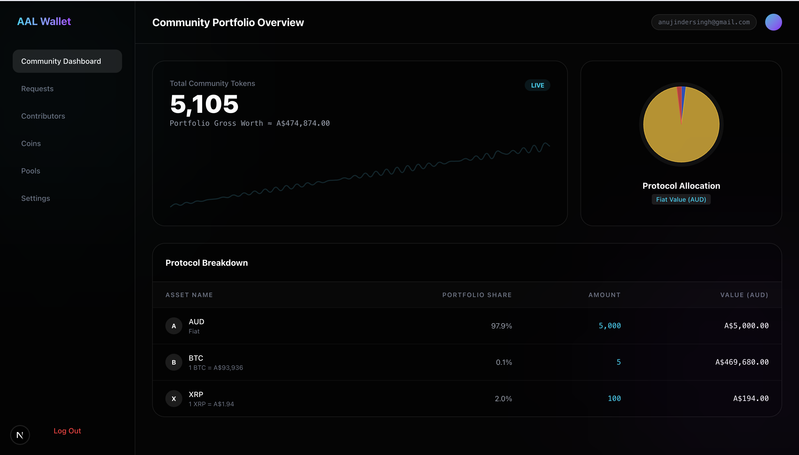

# Collaborative Crypto Portfolio Manager

  

  Main dashboard

## Overview

This project was developed during the XRP Australia 2026 XRPL Hackathon as a proof-of-concept for a role-based collaborative cryptocurrency portfolio management platform.

The system allows multiple users to propose changes to a shared crypto portfolio while an admin user controls the authoritative state of the portfolio. Proposed trades (buying or selling assets) must be approved by the admin before they affect the real portfolio.

The project demonstrates how portfolio operations could be executed using the XRP Ledger.

The frontend for this project can be found here:
[Frontend Repository](https://github.com/AIS170/arp-frontend)

## Core Idea

The platform maintains two states:

- **Authoritative State** – the official portfolio with the real allocations.
- **Proposed State** – a temporary state for each user where they can suggest portfolio changes.

Users can propose the buying and selling of crypto and the admin can choose to approve or reject these proposals. If approved, the changes are merged into the authoritative portfolio and the necessary purchases or sales are executed on the XRP Ledger.

## XRP Integration

This project uses XRPL Testnet to simulate crypto portfolio operations. Wallets are generated for the authoritative portfolio and for currency issuers. Trust lines are established between these wallets and used to simulate token transfers that would occur when interacting with the real XRP Ledger. Since trading is not available on Testnet, this approach demonstrates how the system would function in practice.

## Tech Stack

- Backend: Python, Flask
- Database: Firebase
- Blockchain: XRP Ledger (XRPL Testnet)
- Libraries: xrpl-py, Flask, Firebase
